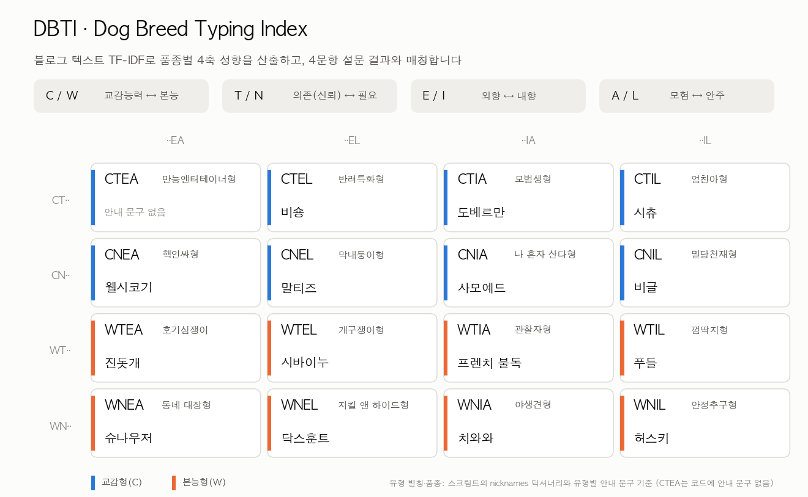
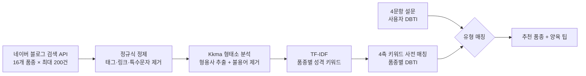

<div align="center">

# 🐶 DBTI: 성격 기반 반려견 추천

**블로그 텍스트 TF-IDF로 16개 품종의 성격 유형을 뽑고, 4문항 설문으로 나와 맞는 반려견을 추천합니다**




<sub>스크립트에 정의된 유형 별칭(<code>nicknames</code>)과 유형별 안내 문구의 품종을 그대로 옮긴 표입니다.</sub>

</div>

---

## 📘 소개

예비 반려인이 **자기 성향에 맞는 반려견 품종**을 고를 수 있게 돕는 서비스입니다.
네이버 블로그에서 `"{품종} 성격"` 검색 결과를 모으고, 형태소 분석으로 형용사를 뽑은 뒤 TF-IDF로 품종마다 두드러지는 성격 키워드를 찾습니다.
이 키워드를 4개 축으로 묶어 품종별 **DBTI(Dog Breed Typing Index)** 를 정하고, 사용자가 4문항에 답하면 같은 유형의 품종을 추천합니다.

## ✨ 주요 기능

- **데이터 수집**: 네이버 검색 Open API(블로그)로 품종별 `"{품종} 성격"` 검색 결과를 품종당 최대 200건(100건 × 2페이지) 수집합니다. 대상은 국내에서 많이 기르는 16개 품종입니다.
  > 진돗개 · 말티즈 · 시츄 · 치와와 · 비숑 · 프렌치 불독 · 슈나우저 · 시바이누 · 골든리트리버 · 사모예드 · 웰시코기 · 도베르만 · 푸들 · 닥스훈트 · 비글 · 허스키
- **텍스트 정제**: HTML 태그, 링크, 특수문자·이모티콘, 숫자, 영문, 광고성 단어를 정규식으로 지웁니다.
- **성격 특성 추출**: KoNLPy `Kkma`로 형용사(`VA`)만 남기고 불용어를 뺀 다음, 품종별 빈도 상위 100개 형용사에 TF-IDF를 적용해 품종을 구별하는 성격 키워드를 고릅니다.
- **DBTI 산출**: 축마다 정의한 키워드 사전과 품종별 TF-IDF 상위 25개 키워드를 비교해 `일치 개수 + TF-IDF 합`으로 점수를 매기고, 두 극 중 점수가 높은 쪽으로 글자를 정합니다.

  | 축 | 의미 | 설문 문항 |
  |---|---|---|
  | **C / W** | 교감능력 ↔ 본능 | 새 장난감을 가져왔을 때의 반응 |
  | **T / N** | 의존(신뢰) ↔ 필요 | 낯선 손님이 왔을 때의 반응 |
  | **E / I** | 외향 ↔ 내향 | 한가한 주말에 바라는 모습 |
  | **A / L** | 모험 ↔ 안주 | 산책 중 새 길을 만났을 때의 반응 |

- **추천**: 설문으로 정해진 사용자 DBTI와 같은 유형의 품종을 찾아 유형 별칭(예: `CTIL` 엄친아형)과 함께 알려주고, 품종 성격과 기를 때 참고할 점을 출력합니다.

## 🏗 구조



```
dog-recommendation-systems/
├── 예비_반려인을_위한_성격_별_반려견_종_추천_서비스_.py   # Colab 노트북을 내보낸 전체 코드
└── docs/
    └── dbti-types.png                                     # README 이미지
```

스크립트를 실행하면 다음 파일이 만들어집니다(저장소에는 포함되어 있지 않습니다).

- `data_dog_personality.xlsx`: 네이버 블로그에서 크롤링한 품종별 텍스트
- `df_significant_personalities.xlsx`: TF-IDF로 뽑은 품종별 유의미한 성격 특성

## 🚀 실행

Google Colab 노트북에서 내보낸 코드라 `!pip install konlpy` 같은 노트북 문법이 섞여 있습니다. **Colab이나 Jupyter에서 셀 단위로 실행**하는 것을 권장합니다.

1. [네이버 개발자센터](https://developers.naver.com/)에서 검색 API 애플리케이션을 등록하고, 발급받은 `client_id`와 `client_secret`을 스크립트 상단에 넣습니다.
2. 의존성을 설치합니다. KoNLPy의 `Kkma`는 Java(JDK)가 필요합니다.
   ```bash
   pip install konlpy nltk scikit-learn pandas openpyxl
   ```
3. 크롤링 → TF-IDF → DBTI 산출 순서로 실행한 뒤, 마지막 설문 셀에서 4개 질문에 `a` 또는 `b`로 답하면 추천 결과가 나옵니다.

## 🛠 기술 스택

| 구분 | 사용 기술 |
|---|---|
| 데이터 수집 | `urllib`, `json`, 네이버 검색 Open API(블로그) |
| 전처리 | `re`(정규식), `pandas` |
| 자연어 처리 | `konlpy`(Kkma 형태소 분석), `nltk`(토큰화, WordNet 표제어 처리) |
| 특성 추출 | `scikit-learn` `TfidfVectorizer` |
| 환경 | Google Colab |

## 📝 참고

- 이 코드와 서비스는 예비 반려인을 위한 참고용입니다. 실제 서비스로 쓰려면 더 많은 데이터와 신뢰할 수 있는 알고리즘이 필요합니다.
- 블로그 텍스트는 품종마다 최대 200건만 사용했으므로, 품종 성격을 대표한다고 보기에는 한계가 있습니다.

---

<div align="center">

<sub>Made by [김민수 (@khwee2000)](https://github.com/khwee2000)</sub>

</div>
